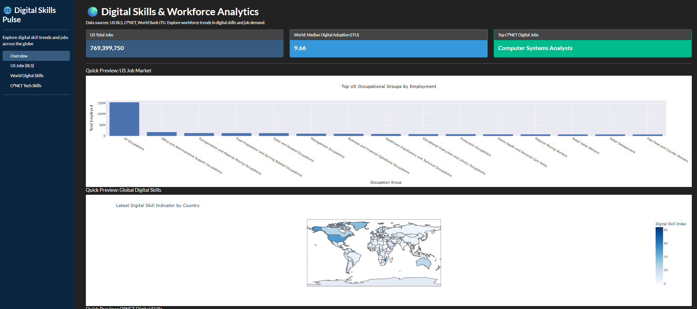

# Python Data Visualizations Portfolio

This portfolio contains interactive Python data visualization projects built using Dash, Plotly, and related tools. Each project is designed to be modern, clean, and production-ready.

---

## 🚀 Project 1: Healthcare Cost & Outcome Analytics (Dash App)

- **Description:**
    - Synthetic healthcare dataset with patient costs, diagnosis, gender, outcomes, and time series.
    - Fully interactive dashboard: diagnosis/gender filtering, date range, KPIs, animated charts, dark/light mode toggle, and Excel download.
    - Modern, mobile-friendly UI/UX (Dash + Bootstrap).

- **Main Features:**
    - Dark mode toggle
    - Responsive, modern layout
    - Animated chart transitions
    - KPI cards (Avg Cost, Recovery Rate, Readmission Rate, Total Patients)
    - Diagnosis & gender slicers, date picker
    - Export filtered data to Excel
    - Designed for fast prototyping and deployment

- **How to Run:**
    1. Clone this repository.
    2. Install requirements:  
       ```
       pip install -r requirements.txt
       ```
    3. Run the app:
       ```
       python "HealthCare Cost & Outcome Analytics (Synthetic).py"
       ```
    4. Open the local link printed in your terminal.

- **Screenshots:**
    - 

---

## 📁 Project Structure

- `HealthCare Cost & Outcome Analytics (Synthetic).py` — Main Dash app
- `requirements.txt` — All dependencies
- `README.md` — This file
- `assets/` — For custom CSS/images (optional, you can add screenshots here)
- 
- 

---

🌐 Project 2: Digital Skills Pulse – Global Workforce Visualizer (Dash App)
- **Description:**

- Interactive dashboard for exploring digital skills, job demand, and tech adoption using real global data. 
- Integrates World Bank/ITU digital skill indicators, US Bureau of Labor Statistics (BLS), and O*NET tech skill data. 
- Modern, mobile-friendly UI/UX (Dash + Bootstrap) with interactive sorting, tooltips, CSV downloads, and contextual data explanations.

- **Main Features:**

- Side navigation: switch between US Jobs (BLS), Global Digital Skills (ITU/World Bank), and O*NET Tech Skills 
- Sortable US jobs by total employment or median salary (with chart/table updating dynamically)
- Beautiful bar/choropleth plots (Plotly) and styled data tables 
- Download Top 15 job groups as CSV 
- Clear metric explanations, help tooltips, color-coded KPIs, and modern look (custom CSS)
- “Last updated” timestamps, footer with info/links, and improved accessibility


- **How to Run:**

1.  Clone this repository. 
2. Ensure you have all required data files in the data/ directory:
   -Project2_Digital_Skills_Pulse_Dash/data/ITU_DH.csv 
   -Project2_Digital_Skills_Pulse_Dash/data/db_29_1_text/Occupation Data.txt 
   -Project2_Digital_Skills_Pulse_Dash/data/db_29_1_text/Technology Skills.txt 
   -Project2_Digital_Skills_Pulse_Dash/data/oesm24nat/national_M2024_dl.xlsx

```
pip install -r requirements.txt
```

Run the app:

```
 python "HealthCare Cost & Outcome Analytics (Synthetic).py"
```


Screenshots:



📁 Project Structure
- `Digital Skills Pulse.py — Main Dash app for Project 2` — Main Dash app 
- `data/ — Folder containing all data sources` (CSV/TXT/XLSX, see above)
- `assets/ — Custom CSS and images`  (e.g., custom_dropdown.css, app screenshots)
- `requirements.txt — All dependencies`
- `README.md` — This file

⚡ Features Overview
- US Jobs/BLS page: sortable by employment or salary, downloadable data, modern cards and KPIs, currency formatting, and custom color themes. 
- World Digital Skills/ITU: choropleth map of digital skill adoption, with index explained. 
- O*NET Tech Skills: bar chart of top digital job titles and mentions. 
- UI polish: badges, tooltips, custom table formatting, “last updated” timestamps, modern Plotly themes, and CSS hover effects.


## 🔜 Upcoming Visualizations
1. Stock/Options Trading Dashboard 
2. Custom Analytics Project (TBD)

---

## 🤝 Contact
- Author: Dom Weber ([domx94](https://github.com/domx94))
- Questions, feedback, or suggestions welcome!
